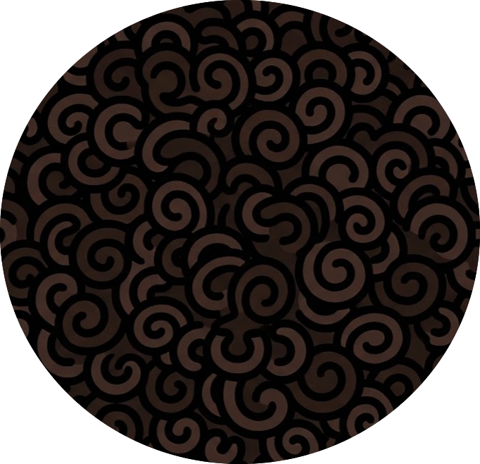

## avidhd
{height=250}

A(vi)DHD is my egoistic tool that serves my need. I operate on zero inbox but not only on email - any notifications I have. The problem is that my notifications are spread across: HubSpot, Notion, Slack, Email, Calendar, Teams, WhatsApp, GitHub.. etc! I want a place to have all of my notifications in one place where I can snooze/push/down. I also always keep a short list of tasks I want to get done so when I don't have any notification to handle, I attend to. I think this is the best way I operate with my ADHD unmedicated, but YMMV.

Software has no any commercial desire or need, I do it for myself and if someone benefits you're welcome to contribute!

Icon is my hair cartoonized from the back of my head.

Licensed under MIT License.
